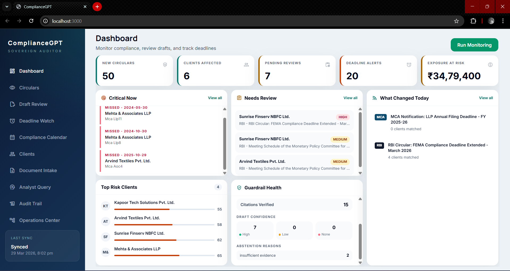
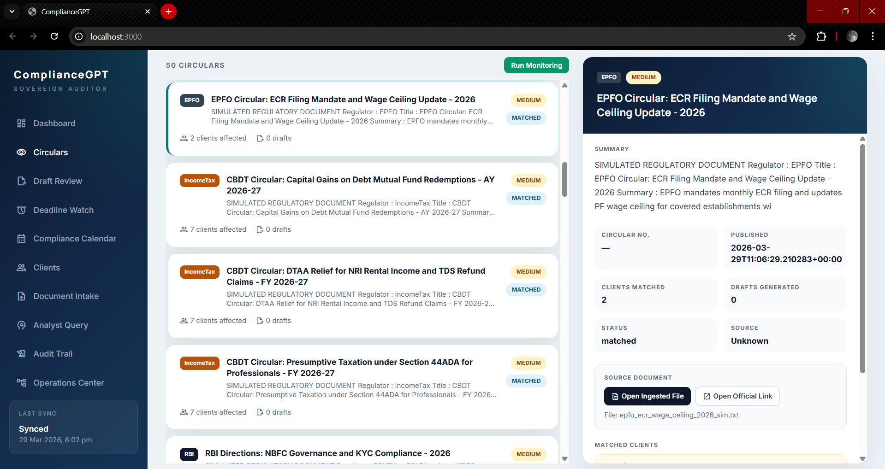
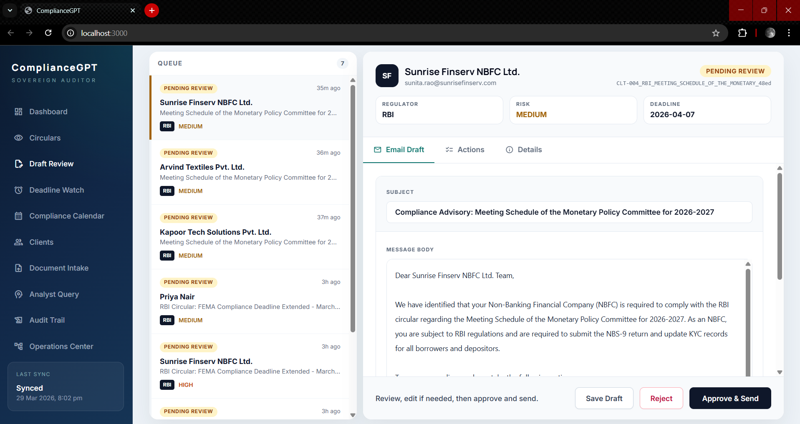
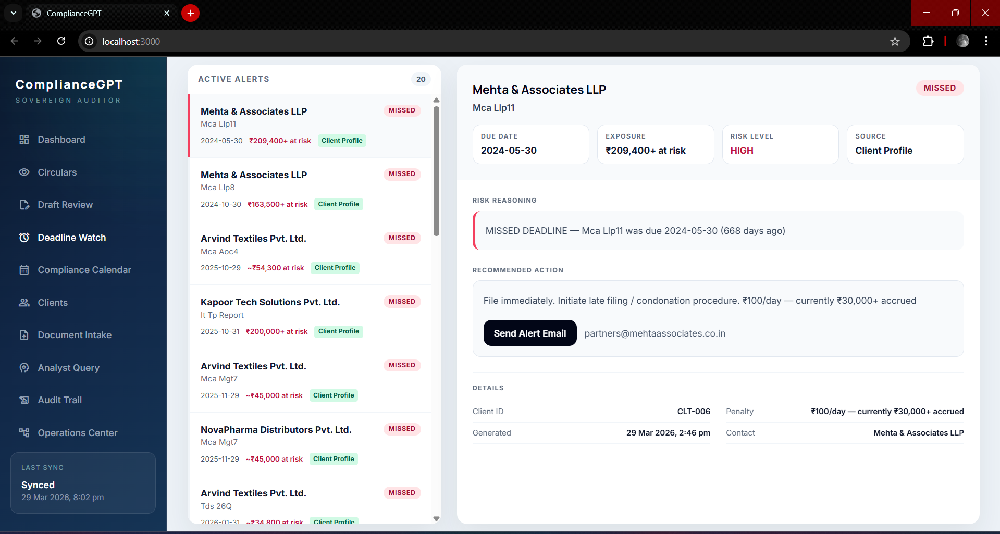
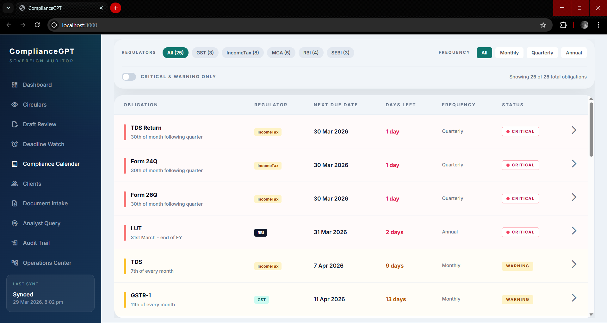
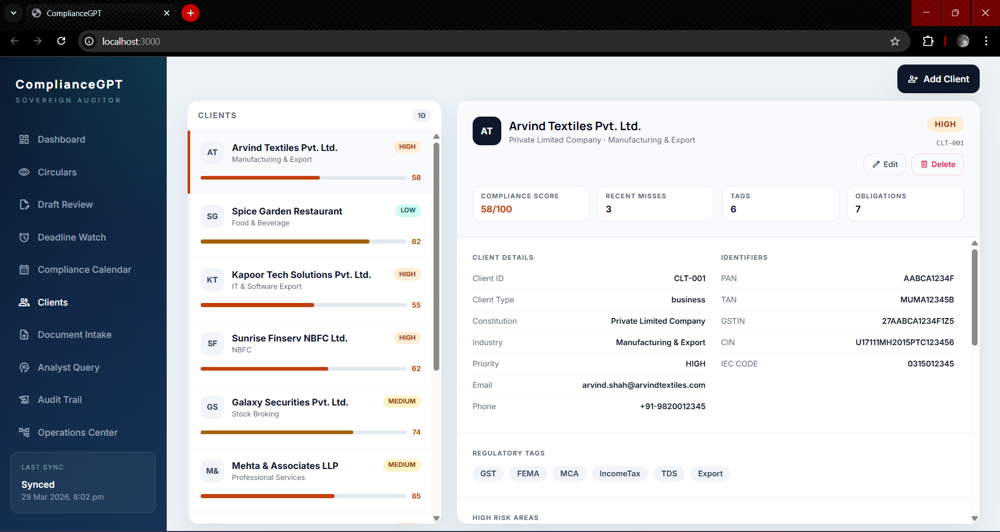
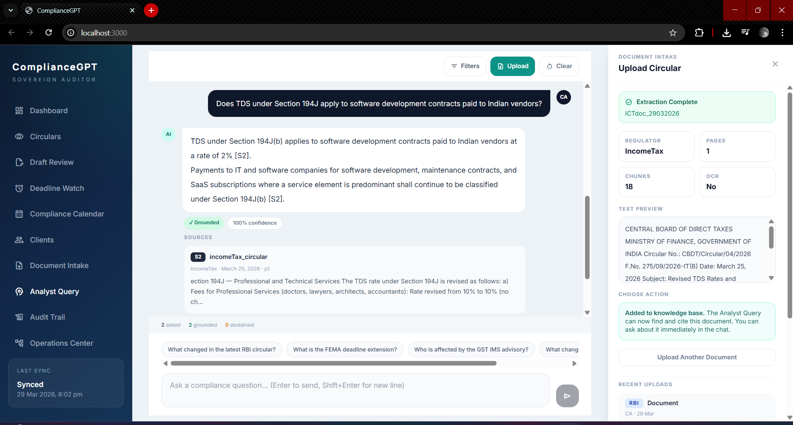
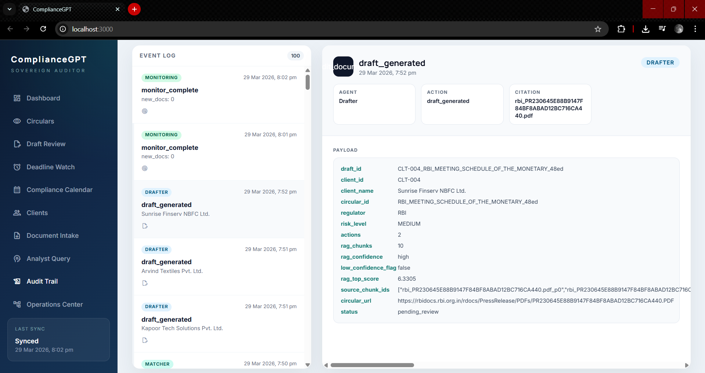

# ComplianceGPT - System Documentation

## What is ComplianceGPT?

ComplianceGPT is an AI-powered compliance monitoring and advisory system for Indian CA (Chartered Accountant) firms. It monitors regulator websites, detects new circulars, ingests them into a persistent knowledge base, matches them to affected clients, generates advisory drafts, and tracks approaching or missed compliance deadlines.

The project is built as a four-stage agent pipeline:
- Stage 1: Monitoring Agent
- Stage 2: Client Matcher
- Stage 3: Drafter Agent
- Stage 4: Deadline Agent

The system also exposes a FastAPI backend, a React dashboard, an analyst-query interface over the stored knowledge base, and scheduled background jobs for monitoring, deadline scans, and reminders.

---

## Local Setup

Use the project virtual environment for backend work.

```bash
./backend/bootstrap_venv.sh
source .venv/bin/activate
cd backend
python -m uvicorn app:app --reload --port 8000
```

Or run the backend through the helper script:

```bash
./backend/run_local.sh
```

Notes:
- The backend expects `.venv` at the repo root.
- Keep using `backend/requirements.txt` for backend dependency changes.
- The first retrieval run may download embedding and reranker models if they are not cached locally.

---

## Architecture Overview

```text
Regulator Websites / Manual Uploads
              |
              v
      +------------------+
      | Monitoring Agent |
      | scrape + ingest  |
      +--------+---------+
               |
               | new_docs[]
               v
      +------------------+
      | Client Matcher   |
      | rules + filters  |
      +--------+---------+
               |
               | match_results[]
               v
      +------------------+
      | Drafter Agent    |
      | RAG + Groq LLM   |
      +--------+---------+
               |
               | draft files
               v
      +------------------+
      | Deadline Agent   |
      | alerts + follow- |
      | up drafts        |
      +------------------+

Shared services:
- FastAPI app + APScheduler
- ChromaDB persistent vector store
- JSON/file persistence for drafts, uploads, pipeline status, alerts
- append-only audit trail in logs/audit.jsonl
```

The FastAPI app in `backend/app.py` drives the frontend, exposes the API, stores pipeline state, and runs scheduled jobs for monitoring, deadline scans, and reminders.

---

## Tech Stack

| Layer | Technology |
|---|---|
| Web scraping | Playwright, `requests`, BeautifulSoup |
| PDF / text ingestion | PyMuPDF (`fitz`) with `pdf2image` + Tesseract OCR fallback |
| Embeddings | `all-MiniLM-L6-v2` (sentence-transformers) |
| Vector store | ChromaDB (persistent, local) |
| Keyword retrieval | BM25 (`rank-bm25`) |
| Reranking | `cross-encoder/ms-marco-MiniLM-L-6-v2` |
| LLMs | Groq API - draft models: `llama-3.1-8b-instant`, `gemma2-9b-it`; query/config model: `llama-3.3-70b-versatile` |
| Backend API | FastAPI + Uvicorn |
| Scheduling | APScheduler |
| Frontend | React + Vite |
| Persistence | ChromaDB + JSON/file-based storage |
| Containerization | Docker + Docker Compose |

---

## Directory Structure

```text
ComplianceGPT/
|-- backend/
|   |-- agents/
|   |   |-- monitoring_agent.py   # Stage 1: scrape, dedupe, ingest
|   |   |-- client_matcher.py     # Stage 2: client matching
|   |   |-- drafter_agent.py      # Stage 3: advisory drafting
|   |   `-- deadline_agent.py     # Stage 4: deadline scans and alert drafts
|   |-- core/
|   |   |-- ingest.py             # PDF/TXT -> chunks -> ChromaDB
|   |   |-- retriever.py          # analyst query / hybrid RAG
|   |   |-- chroma_client.py      # persistent ChromaDB wrapper
|   |   `-- audit.py              # audit log helpers
|   |-- data/
|   |   |-- pdfs/                 # scraped and uploaded source files
|   |   |-- drafts/               # advisory draft JSON files
|   |   |-- deadline_alerts/      # alert snapshots
|   |   |-- latest_pipeline_status.json
|   |   `-- uploaded_documents.json
|   |-- logs/
|   |   |-- audit.jsonl
|   |   `-- seen_documents.json
|   |-- vectorstore/              # persistent ChromaDB files
|   |-- app.py                    # FastAPI app + scheduler + endpoints
|   |-- orchestrator.py           # standalone pipeline runner
|   |-- config.py                 # paths, models, constants
|   |-- metrics.py
|   `-- clients.json              # demo client dataset
|-- frontend/
|   `-- src/                      # React frontend
|-- docs/
|   |-- architecture.md
|   `-- ARCHITECTURE_SUBMISSION.md
|-- docker-compose.yml
`-- README.md
```

---

## Stage 1 - Monitoring Agent

**File:** `backend/agents/monitoring_agent.py`  
**Entry point:** `run_monitoring_agent(simulate_mode, regulators, auto_ingest)`

This agent detects new regulatory documents, validates them, and ingests them into the knowledge base.

### Active live scrapers

- RBI press releases via Playwright
- RBI circular index via Playwright
- GST / CBIC-GST circulars via Playwright, with HTTP fallback if needed
- Income Tax circulars via Playwright, with HTTP fallback logic in the scraper

### Current non-active scraper code

- MCA scraper code exists but is currently disabled in the main live monitoring flow
- EPFO scraper code exists but is currently disabled in the main live monitoring flow

### Core monitoring flow

1. Scrape candidate regulator links
2. Filter to recent and relevant documents
3. Deduplicate using SHA-256 and `logs/seen_documents.json`
4. Validate downloaded files
5. Save files to `backend/data/pdfs/`
6. Ingest valid PDF or TXT content into ChromaDB

### Validation and deduplication

- URLs / content samples are hashed before processing
- already-seen documents are skipped
- non-PDF downloads and HTML challenge pages are rejected
- failures in one scraper do not stop the others

### Ingestion pipeline

`backend/core/ingest.py` performs:

1. PyMuPDF text extraction
2. OCR fallback with `pdf2image` + Tesseract when extracted text is too sparse
3. regulator tagging from filename and content
4. structure-aware chunking
5. embedding with `all-MiniLM-L6-v2`
6. persistence into ChromaDB collection `compliance_docs`

### Simulate mode

When `simulate_mode=True`, the agent uses hardcoded simulated documents instead of live scraping. This is useful for testing the full pipeline without hitting regulator websites.

Note: simulate mode is explicit. Real scraping does not automatically switch to simulate mode unless you request it.

---

## Stage 2 - Client Matcher

**File:** `backend/agents/client_matcher.py`  
**Entry point:** `match_clients(new_docs)`

This agent decides which clients are affected by each new circular.

### Data source

The matcher reads structured client records from `backend/clients.json`. The dataset includes 10 demo clients with obligations, tags, registrations, profile details, and compliance context.

### Matching approach

The current matcher is better described as a 4-stage flow:

1. Market-ops / noise filter  
   Non-compliance releases are filtered out before matching.

2. Obligation-driven match  
   The strongest path checks whether a client already has obligations relevant to the circular's regulator.

3. Tag / registration fallback  
   When obligation matching is not enough, the matcher falls back to tags and registrations such as GST, MCA, EPFO-related indicators, company type, GSTIN, CIN, and similar structured fields.

4. Content filter  
   Title and summary text are checked against domain-specific rules so generic circulars are not matched too broadly.

### Output shape

The matcher returns one result per circular, for example:

```python
[
  {
    "circular_title": "RBI Circular: FEMA Compliance Update",
    "regulator": "RBI",
    "priority": "HIGH",
    "summary": "...",
    "affected_clients": [
      {
        "client_id": "CLT-001",
        "name": "Arvind Textiles Pvt. Ltd.",
        "reason": "Exporting entity with FEMA obligations"
      }
    ],
    "match_count": 1
  }
]
```

### Priority assignment

Circular priority is inferred from title and summary signals such as:
- HIGH: penalty, mandatory, FEMA, urgent, deadline extension with strong impact
- MEDIUM: filing, return, compliance update, notification
- LOW: advisory, clarification, informational guidance

---

## Stage 3 - Drafter Agent

**File:** `backend/agents/drafter_agent.py`  
**Entry point:** `draft_advisories(match_results)`

This stage generates client-specific advisory drafts for matched circular-client pairs.

### Drafting flow

1. Build an obligation-driven RAG query  
   The query is not just the circular title. It combines regulator, circular metadata, and obligation-specific search terms mapped from the client's obligations.

2. Retrieve relevant context  
   The drafter uses:
   - ChromaDB vector search
   - BM25 keyword retrieval
   - Reciprocal Rank Fusion (RRF)
   - cross-encoder reranking

3. LLM call for obligation extraction  
   The LLM extracts client-specific actions, deadline, risk level, penalty notes, and internal review notes.

4. Deadline normalization  
   Raw deadline text is normalized into structured formats such as ISO, RELATIVE, PERIODIC, or lookup-driven recurring dates.

5. LLM call for email drafting  
   A client-facing advisory email is generated using the extracted obligations and retrieved context.

6. Save draft JSON  
   Drafts are written to `backend/data/drafts/` for frontend review.

### Model usage

Draft generation uses priority-based Groq models:
- HIGH -> `llama-3.1-8b-instant`
- MEDIUM -> `llama-3.1-8b-instant`
- LOW -> `gemma2-9b-it`

### Draft review workflow

Drafts are stored with review state and are intended for CA review before sending. The backend and frontend support approve, save, reopen, delete, and send flows.

### Error handling

- malformed LLM JSON falls back to safe structured defaults
- rate limit errors are retried with backoff
- one failed client draft does not stop the rest of the run

---

## Stage 4 - Deadline Agent

**File:** `backend/agents/deadline_agent.py`  
**Entry point:** `scan_deadlines(clients=None)`

This stage scans both client obligations and generated drafts for approaching or missed deadlines.

### Supported deadline forms

- ISO dates
- relative deadlines such as `RELATIVE:N`
- periodic deadlines such as monthly or quarterly patterns
- lookup-driven recurring compliance deadlines

### Alert levels

- `MISSED`: past due
- `CRITICAL`: due in 3 days or less
- `WARNING`: due in 14 days or less
- `OK`: no active alert generated

### Output

Alerts include fields such as:
- level
- client
- due date
- risk level
- penalty
- financial exposure
- recommended action

### Extra behavior

- urgent alerts can trigger deterministic follow-up deadline drafts
- unparseable dates are skipped instead of crashing the scan

---

## Orchestrator - Pipeline Controller

**File:** `backend/orchestrator.py`  
**Entry point:** `run_pipeline(simulate_mode=False)`

The orchestrator runs the full agent sequence:

```text
[1/4] Monitoring Agent
  -> if no new docs, stop early

[2/4] Client Matcher
  -> if no actionable matches, stop early
  -> skip LOW priority circulars in the standalone run
  -> sort actionable items by priority

[3/4] Drafter Agent
  -> generate advisory drafts

[4/4] Deadline Agent
  -> scan deadlines
  -> summarize alerts
  -> auto-generate urgent deadline drafts for MISSED / CRITICAL alerts
```

### Running options

```bash
# Run once immediately
python orchestrator.py --run-now

# Run on a schedule
python orchestrator.py --schedule

# Run with simulated data
python orchestrator.py --run-now --simulate

# Custom schedule interval
python orchestrator.py --schedule --interval 12
```

### Throughput controls

The standalone orchestrator caps total drafts per run and prioritizes higher-impact items first to reduce token pressure and keep the run useful under limited Groq capacity.

---

## Supporting Infrastructure

### ChromaDB vector store

- stored in `backend/vectorstore/`
- collection name: `compliance_docs`
- holds embedded chunks plus metadata such as source, page, regulator, title, URL, and document date
- reused by the drafter, analyst query, and persisted circular catalog

### Persistent JSON / file storage

- `backend/data/pdfs/` - scraped and uploaded source documents
- `backend/data/drafts/` - advisory and deadline draft files
- `backend/data/deadline_alerts/` - saved alert snapshots
- `backend/data/latest_pipeline_status.json` - last pipeline status for the UI
- `backend/data/uploaded_documents.json` - upload registry for manually added documents
- `backend/logs/seen_documents.json` - deduplication hash database
- `backend/logs/audit.jsonl` - append-only audit log

### Analyst query layer

`backend/core/retriever.py` provides the query path used by the frontend:
- hybrid retrieval over the persistent knowledge base
- regulator and document filtering
- reranking and citation-aware answering
- guardrail behavior when evidence is weak

### Configuration

Core configuration is defined in `backend/config.py`, including:

```python
EMBEDDING_MODEL = "all-MiniLM-L6-v2"
CHROMA_COLLECTION = "compliance_docs"
CHUNK_SIZE = 1500
CHUNK_OVERLAP = 150
TOP_K = 10
MIN_RELEVANCE_SCORE = 0.20
OCR_CHAR_THRESHOLD = 50
```

---

## Full Data Flow (End to End)

```text
1. Regulator websites or manual upload provide new source documents
2. Monitoring Agent scrapes / validates / deduplicates documents
3. Valid files are stored in backend/data/pdfs/
4. core/ingest.py extracts text, runs OCR when needed, chunks content, embeds it, and stores it in ChromaDB
5. Client Matcher receives new_docs[] and determines affected clients
6. Drafter Agent receives match_results[] and runs obligation-driven hybrid RAG
7. Groq generates structured obligations and client-facing advisory drafts
8. Draft JSON files are saved for CA review in the frontend
9. Deadline Agent scans obligations and saved drafts for due or missed compliance tasks
10. Deadline alerts and urgent follow-up drafts are persisted for dashboard review
11. Analyst Query can answer questions directly from the previously stored knowledge base
```

---

## Current Scraper Coverage

| Regulator | Source | Status |
|---|---|---|
| RBI | Press Releases page | Working |
| RBI | Circular Index / Notifications | Working |
| GST | CBIC-GST circulars | Working |
| IncomeTax | incometaxindia.gov.in circulars | Working with fallback logic |
| MCA | mca.gov.in scraper code present | Currently disabled in main live flow |
| EPFO | epfindia scraper code present | Currently disabled in main live flow |

---

## Screenshots

### Dashboard



### Circular Intelligence



### Draft Review



### Draft Review Actions


### Deadline Watch



### Compliance Calendar



### Client Management



### Analyst Query



### Audit Trail



---

## Environment Variables

Create a `.env` file in the project root:

```env
GROQ_API_KEY=your_groq_api_key_here
SMTP_USER=your_email_if_using_send_features
SMTP_PASS=your_app_password_if_using_send_features
```

Minimum requirement:
- `GROQ_API_KEY`

Optional:
- `SMTP_USER` and `SMTP_PASS` if you want email send features to work

---

## Running with Docker

```bash
# Build and start
docker compose up --build -d

# Run pipeline manually inside container
docker exec compliancegpt-backend python /app/orchestrator.py --run-now


# View logs
docker logs compliancegpt-backend -f
```
